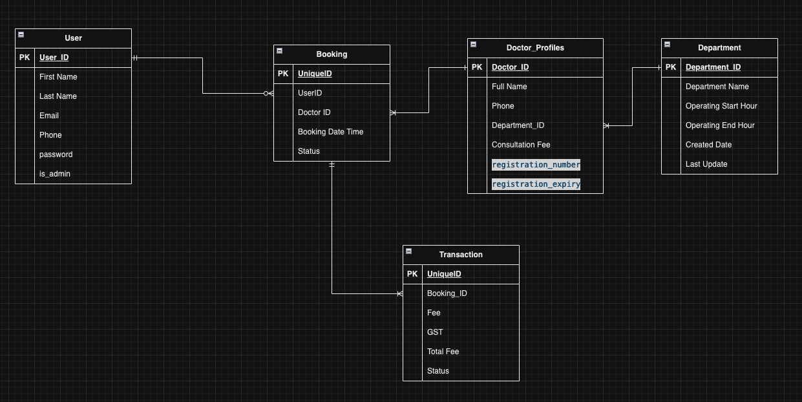
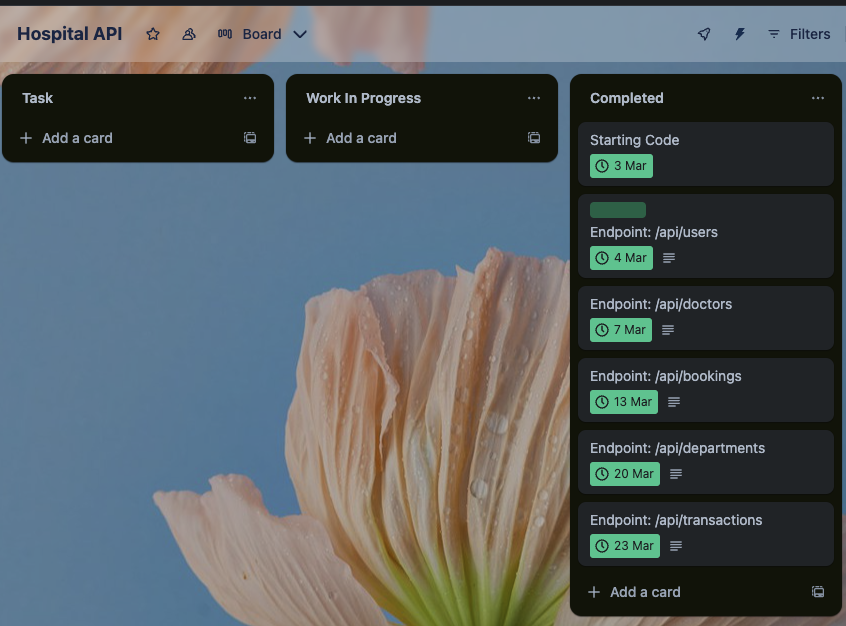

## [GitHub](https://github.com/Suraj-Razor/Hospital_API)

# R5 Document all endpoints for your API

# Doctor Endpoints

## Get all doctors

### Endpoint

- URL: `/doctor/`
- Method: GET
- Access: Public
- Description: Retrieves details of all doctors.

### Request

- Headers: None

### Response

- Status Code: 200 OK
- Body: JSON array containing details of all doctors.

## Register new doctor

### Endpoint

- URL: `/doctor/<int:department_id>/register`
- Method: POST
- Access: JWT required
- Description: Registers a new doctor under the specified department.

### Request

- Headers:
  - Authorization: Bearer [JWT Token]
- Body: JSON object containing details of the new doctor.

### Response

- Status Code: 200 OK
- Body: JSON object containing details of the newly registered doctor.

## Delete doctor profile

### Endpoint

- URL: `/doctor/<int:doctor_id>`
- Method: DELETE
- Access: Admin only
- Description: Deletes the profile of the specified doctor.

### Request

- Headers:
  - Authorization: Bearer [JWT Token]
- Body: None

### Response

- Status Code: 200 OK
- Body: JSON object with a success message.

## Edit doctor profile

### Endpoint

- URL: `/doctor/<int:doctor_id>`
- Method: PUT, PATCH
- Access: Admin only
- Description: Updates the profile of the specified doctor.

### Request

- Headers:
  - Authorization: Bearer [JWT Token]
- Body: JSON object containing updated details of the doctor.

### Response

- Status Code: 200 OK
- Body: JSON object containing details of the updated doctor.

**Note:** Admin authorization is required for the "Delete doctor profile" and "Edit doctor profile" endpoints.

# User Endpoints

## Get User

- **URL:** `/user/`
- **Method:** GET
- **Description:** Retrieves details of all users.
- **Returns:**
  - List of all users in JSON format.

## Create User

- **URL:** `/user/new`
- **Method:** POST
- **Description:** Creates a new user.
- **Request Body:**
  - `first_name`: First name of the user.
  - `last_name`: Last name of the user.
  - `phone`: Phone number of the user.
  - `email`: Email address of the user.
  - `password`: Password for the user.
- **Returns:**
  - Details of the created user in JSON format.

## User Login

- **URL:** `/user/login`
- **Method:** POST
- **Description:** Logs in a user.
- **Request Body:**
  - `email`: Email address of the user.
  - `password`: Password for the user.
- **Returns:**
  - If successful:
    - `email`: Email address of the logged-in user.
    - `token`: Access token for the user session.
    - `is_admin`: Boolean indicating if the user is an admin or not.
  - If unsuccessful:
    - Error message indicating incorrect email or password.

# Booking Endpoints

### User Bookings

- **URL:** `/booking/user`
- **Method:** GET
- **Access:** JWT required
- **Description:** Retrieves bookings associated with the authenticated user.
- **Returns:**
  - JSON array containing user's bookings.
- **Error Responses:**
  - 401 Unauthorized: Login error.
- **Usage:**
  - Requires JWT token in the request headers.

### Book Appointment

- **URL:** `/booking/<int:doctor_id>`
- **Method:** POST
- **Access:** JWT required
- **Description:** Books an appointment with the specified doctor for the authenticated user.
- **Request Body:**
  - `booking_date_time`: Date and time of the appointment in 'dd/mm/yyyy hh:mm:ss' format.
- **Returns:**
  - JSON object containing details of the booked appointment.
- **Error Responses:**
  - 404 Not Found: Doctor with specified ID does not exist or invalid date-time format.
  - 400 Bad Request: Booking date-time should be within 30 days from now.
- **Usage:**
  - Requires JWT token in the request headers.
  - Expects valid doctor ID and booking date-time in the request body.

### All Bookings

- **URL:** `/booking/`
- **Method:** GET
- **Description:** Retrieves details of all bookings.
- **Returns:**
  - JSON array containing details of all bookings.
- **Usage:**
  - Public endpoint.

### Edit Bookings

- **URL:** `/booking/<int:booking_id>`
- **Method:** PUT/PATCH
- **Access:** JWT required
- **Description:** Edits status of the booking with the specified ID for the authenticated user. Only 'Cancelled' status is accepted.
- **Request Body:**
  - `status`: New status of the booking.
- **Returns:**
  - Success message if booking status is successfully edited.
- **Error Responses:**
  - 400 Bad Request: Either booking does not exist or invalid status passed. Only 'Cancelled' is accepted as a valid status.
- **Usage:**
  - Requires JWT token in the request headers.
  - Expects valid booking ID and status in the request body.

### Delete Bookings

- **URL:** `/booking/<int:booking_id>`
- **Method:** DELETE
- **Access:** JWT required
- **Description:** Deletes the booking with the specified ID for the authenticated user.
- **Returns:**
  - Success message if booking is successfully deleted.
- **Error Responses:**
  - 400 Bad Request: Booking not found.
- **Usage:**
  - Requires JWT token in the request headers.
  - Expects valid booking ID.

# Department Endpoints

## List All Departments

- **URL:** `/department/`
- **Method:** GET
- **Description:** Retrieves details of all departments.
- **Returns:**
  - List of department details in JSON format.

## Add New Department

- **URL:** `/department/new`
- **Method:** POST
- **Authorization:** Required (JWT token)
- **Description:** Adds a new department.
- **Request Body:**
  - `department_name`: Name of the department.
  - `operating_start_hour`: Operating start hour of the department (HH:MM format).
  - `operating_end_hour`: Operating end hour of the department (HH:MM format).
- **Returns:**
  - Details of the newly added department in JSON format.

## Edit Department

- **URL:** `/department/<int:department_id>`
- **Method:** PUT or PATCH
- **Authorization:** Required (JWT token)
- **Description:** Edits details of a specific department.
- **Request Body:**
  - Optional fields to be updated: `department_name`, `operating_start_hour`, `operating_end_hour`.
- **Returns:**
  - Details of the updated department in JSON format.

## Delete Department

- **URL:** `/department/<int:department_id>`
- **Method:** DELETE
- **Authorization:** Required (JWT token)
- **Description:** Deletes a specific department.
- **Returns:**
  - Success message if the department is successfully deleted.

## Input Validation

- The `add_new_department` and `edit_department` endpoints validate the input for `operating_start_hour` and `operating_end_hour` to ensure they are in the correct format (HH:MM) and that `operating_end_hour` is not before `operating_start_hour`.
- If the input is invalid, appropriate error messages with status code 400 are returned.

## Authorization

- All endpoints that modify department data (`add_new_department`, `edit_department`, `delete_department`) require authentication using JWT token.
- Only administrators are authorized to perform these actions.

# Transaction Endpoints

## Get all user transactions

### Endpoint

- URL: `/transactions/`
- Method: GET
- Access: JWT required
- Description: Retrieves all transactions associated with the logged-in user.

### Request

- Headers:
  - Authorization: Bearer [JWT Token]

### Response

- Status Code: 200 OK
- Body: JSON array containing details of all transactions.
- Fields:
  - id: Unique identifier of the transaction.
  - fee: Fee amount.
  - GST: Goods and Services Tax amount.
  - total_fee: Total fee including GST.
  - status: Status of the transaction.
  - booking: Booking details associated with the transaction.

## Pay booking

### Endpoint

- URL: `/transactions/<int:booking_id>`
- Method: POST
- Access: JWT required
- Description: Initiates payment for the specified booking.

### Request

- Headers:
  - Authorization: Bearer [JWT Token]
- Body: None

### Response

- Status Code: 200 OK
- Body: JSON object containing details of the new transaction.
- Fields:
  - id: Unique identifier of the transaction.
  - fee: Fee amount.
  - GST: Goods and Services Tax amount.
  - total_fee: Total fee including GST.
  - status: Status of the transaction.
  - booking: Booking details associated with the transaction.

## Refund booking

### Endpoint

- URL: `/transactions/<int:transaction_id>`
- Method: PUT, PATCH
- Access: Admin only
- Description: Refunds the specified transaction.

### Request

- Headers:
  - Authorization: Bearer [JWT Token]
- Body: None

### Response

- Status Code: 200 OK
- Body: JSON object containing details of the refunded transaction.
- Fields:
  - id: Unique identifier of the transaction.
  - fee: Fee amount.
  - GST: Goods and Services Tax amount.
  - total_fee: Total fee including GST.
  - status: Status of the transaction.
  - booking: Booking details associated with the transaction.

## Delete transaction

### Endpoint

- URL: `/transactions/<int:transaction_id>`
- Method: DELETE
- Access: Admin only
- Description: Deletes the specified transaction.

### Request

- Headers:
  - Authorization: Bearer [JWT Token]
- Body: None

### Response

- Status Code: 200 OK
- Body: JSON object with a success message.

**Note:** The admin authorization is required for the "Refund booking" and "Delete transaction" endpoints.

# R6 An ERD for your app

# R7 Detail any third party services that your app will use

Below is a detailed explanation of each third-party service:

### Flask

**Description:** Flask is a lightweight micro web framework for building web applications in Python. It offers a simple and flexible design, providing developers with the necessary tools, libraries, and patterns to create scalable web services. Flask follows the WSGI (Web Server Gateway Interface) standard and is known for its simplicity, making it suitable for projects ranging from simple prototypes to complex web applications.

**Role in the App:** Within the application, Flask serves as the foundational framework, providing essential features such as URL routing, request handling, and response generation. It handles HTTP requests and responses, allowing developers to define routes and bind them to functions that execute application logic. Additionally, Flask facilitates the integration of various extensions and middleware, enabling developers to extend its functionality as needed for specific project requirements.

### SQLAlchemy

**Description:** SQLAlchemy is a comprehensive SQL toolkit and Object-Relational Mapping (ORM) library for Python. It offers a powerful set of tools for working with relational databases, providing a high-level abstraction layer over SQL databases. SQLAlchemy supports a wide range of database systems and offers flexible data manipulation and querying capabilities.

**Role in the App:** SQLAlchemy plays a crucial role in managing database interactions within the application. Integrated with Flask through the Flask-SQLAlchemy extension, it simplifies database operations by allowing developers to work with Python objects instead of directly writing SQL queries. SQLAlchemy handles tasks such as database schema definition, data querying, and transaction management, providing an efficient and Pythonic way to interact with the underlying database.

### Marshmallow

**Description:** Marshmallow is a popular Python library for object serialization and deserialization. It provides a simple and flexible way to convert complex data types, such as objects or data structures, to and from native Python data types. Marshmallow is commonly used in web applications for processing HTTP requests and responses, validating input data, and formatting API responses.

**Role in the App:** Within the application, Marshmallow integrates with Flask through the Flask-Marshmallow extension. It facilitates data serialization and validation, ensuring that data exchanged between the application and clients is in the appropriate format and adheres to predefined schemas. Marshmallow helps streamline the handling of data within the application, improving reliability and maintainability.

### PostgreSQL

**Description:** PostgreSQL is a powerful open-source relational database management system (RDBMS) known for its reliability, robust features, and scalability. It supports various advanced SQL features and offers ACID (Atomicity, Consistency, Isolation, Durability) compliance, making it suitable for a wide range of applications, from small-scale projects to large enterprise systems.

**Role in the App:** PostgreSQL serves as the backend database for the application, providing persistent storage for application data. It stores information such as user accounts, appointments, department details, and transactions. PostgreSQL ensures data integrity and consistency, facilitating efficient data retrieval and manipulation operations within the application.

### Bcrypt

**Description:** Bcrypt is a cryptographic hashing algorithm designed for securely hashing passwords. It incorporates salting and cost factor parameters to protect against brute-force and rainbow table attacks, making it a popular choice for password hashing in web applications.

**Role in the App:** Within the application, Bcrypt is used to securely hash and verify user passwords. It helps protect user accounts from unauthorized access in the event of a data breach or security compromise. Bcrypt, likely integrated with Flask through the Flask-Bcrypt extension, ensures that user passwords are stored securely and cannot be easily compromised.

### JSON Web Tokens (JWT) Authentication and Authorization

**Description:** JSON Web Tokens (JWT) are compact, URL-safe tokens used for securely transmitting information between parties as JSON objects. JWTs are commonly used in web applications for implementing authentication and authorization mechanisms.

**Role in the App:** JWT authentication and authorization mechanisms are integrated into the application, possibly through the Flask-JWT-Extended extension. JWTs are issued to users upon successful authentication and contain encoded information such as user ID and role. They are included in subsequent requests to authenticate and authorize users accessing protected resources, ensuring secure communication between the client and the server.

### Psycopg2

**Description:** Psycopg2 is a PostgreSQL adapter for Python, providing a PostgreSQL database API compliant with the Python DB-API 2.0 specification. It allows Python applications to interact with PostgreSQL databases by establishing connections, executing SQL queries, and managing transactions.

**Role in the App:** Psycopg2 enables the application to communicate with the PostgreSQL database. It handles tasks such as establishing connections, executing SQL queries, and fetching results. Psycopg2 serves as the intermediary between the Python application and the PostgreSQL database, facilitating efficient database operations within the Flask application.

# R8 Describe your projects models in terms of the relationships they have with each other

# Booking Model

## Description

The Booking model serves as a representation of appointments made within the system. It contains essential details such as the booking date and time, along with the status of the booking. Additionally, it maintains foreign key references to the associated user and doctor involved in the appointment.

## Fields

- `id`: Integer
  - Description: Unique identifier for the booking.
- `booking_date_time`: DateTime
  - Description: Date and time of the booking.
  - Constraints: Not nullable.
- `status`: String
  - Description: Status of the booking.
  - Default: "Booked".
- `user_id`: Integer
  - Description: Foreign key referencing the user associated with the booking.
  - Constraints: Not nullable.
- `doctor_id`: Integer
  - Description: Foreign key referencing the doctor associated with the booking.
  - Constraints: Not nullable.

## Relationships

- **User Relationship:** Each booking is associated with a single user who made the appointment. This establishes a many-to-one relationship between bookings and users.
- **Doctor Relationship:** Similarly, each booking is associated with a single doctor for whom the appointment is booked, creating another many-to-one relationship between bookings and doctors.
- **Transaction Relationship:** A booking can have multiple transactions associated with it, representing financial transactions related to the appointment. This relationship is one-to-many, as multiple transactions can be linked to a single booking.

# User Model

## Description

The User model represents individuals who interact with the system, such as making appointments. It contains fields for user details like first name, last name, email, and password, along with whether the user has admin privileges.

## Fields

- `id`: Integer
  - Description: Unique identifier for the user.
- `first_name`: String
  - Description: First name of the user.
- `last_name`: String
  - Description: Last name of the user.
- `phone`: Integer
  - Description: Phone number of the user.
- `email`: String
  - Description: Email address of the user.
  - Constraints: Unique, Not nullable.
- `password`: String
  - Description: Password of the user.
  - Constraints: Not nullable.
- `is_admin`: Boolean
  - Description: Indicates whether the user is an admin or not.
  - Default: False.

## Relationships

- **Booking Relationship:** Users can have multiple bookings associated with them, indicating the appointments they have scheduled. This establishes a one-to-many relationship between users and bookings.

# Doctor Model

## Description

The Doctor model represents medical professionals who provide services within the system. It includes fields such as full name, registration number, registration expiry, and consultation fee.

## Fields

- `id`: Integer
  - Description: Unique identifier for the doctor.
- `full_name`: String
  - Description: Full name of the doctor.
- `registration_number`: Integer
  - Description: Registration number of the doctor.
  - Constraints: Not nullable, Unique.
- `registration_expiry`: Date
  - Description: Expiry date of the doctor's registration.
  - Constraints: Not nullable.
- `consultation_fee`: Float
  - Description: Fee charged for consultation.
  - Constraints: Not nullable.
- `department_id`: Integer
  - Description: Foreign key referencing the department to which the doctor belongs.
  - Constraints: Not nullable.

## Relationships

- **Department Relationship:** Each doctor belongs to a single department, establishing a one-to-many relationship between doctors and departments.
- **Booking Relationship:** Doctors can have multiple bookings associated with them, indicating the appointments they have scheduled. This creates a one-to-many relationship between doctors and bookings.

# Transaction Model

## Description

The Transaction model represents financial transactions related to bookings. It contains fields such as fee, GST, total fee, and status.

## Fields

- `id`: Integer
  - Description: Unique identifier for the transaction.
- `fee`: Float
  - Description: Fee amount.
  - Constraints: Not nullable.
- `GST`: Float
  - Description: Goods and Services Tax amount.
  - Constraints: Not nullable.
- `status`: String
  - Description: Status of the transaction.
- `total_fee`: Float
  - Description: Total fee including GST.
  - Constraints: Not nullable.
- `booking_id`: Integer
  - Description: Foreign key reference to the associated booking.
  - Constraints: Not nullable.

## Relationships

- **Booking Relationship:** Each transaction is associated with a single booking, representing the appointment to which the transaction pertains. This establishes a many-to-one relationship between transactions and bookings.

# Department Model

## Description

The Department model represents the departments or specializations to which doctors belong within the system. It contains information such as the department name, operating hours, and creation/update timestamps.

## Fields

- `id`: Integer
  - Description: Unique identifier for the department.
- `department_name`: String
  - Description: Name of the department.
  - Constraints: Not nullable, Unique.
- `operating_start_hour`: Time
  - Description: Operating start hour of the department.
  - Constraints: Not nullable.
- `operating_end_hour`: Time
  - Description: Operating end hour of the department.
  - Constraints: Not nullable.
- `created_date`: Date
  - Description: Date when the department was created.
- `last_update`: Date
  - Description: Date when the department was last updated.

## Relationships

- **Doctor Relationship:** Each department can have multiple doctors associated with it, representing the medical professionals working within that department. This creates a one-to-many relationship between departments and doctors.

# R9 Discuss the database relations to be implemented in your application

# Database Relations in Our Application

1. **User-Booking Relation:**

   - **Description:** Each user can schedule multiple appointments (bookings) within the system.
   - **Database Relationship:** One-to-Many (1:N)
   - **Implementation:** The User model will have a one-to-many relationship with the Booking model. This means that each user can have multiple bookings associated with them, but each booking belongs to only one user.

2. **Doctor-Booking Relation:**

   - **Description:** Doctors can have multiple appointments scheduled with them.
   - **Database Relationship:** One-to-Many (1:N)
   - **Implementation:** The Doctor model will have a one-to-many relationship with the Booking model. This indicates that each doctor can have multiple bookings associated with them, but each booking is for only one doctor.

3. **Booking-Transaction Relation:**

   - **Description:** Each booking can have one or more financial transactions associated with it.
   - **Database Relationship:** One-to-Many (1:N)
   - **Implementation:** The Booking model will have a one-to-many relationship with the Transaction model. This implies that each booking may have multiple transactions, but each transaction corresponds to only one booking.

4. **Department-Doctor Relation:**

   - **Description:** Doctors are associated with specific departments within the medical facility.
   - **Database Relationship:** One-to-Many (1:N)
   - **Implementation:** The Department model will have a one-to-many relationship with the Doctor model. This signifies that each department can have multiple doctors, but each doctor belongs to only one department.

5. **Booking-User Relation:**

   - **Description:** Each booking is made by a single user.
   - **Database Relationship:** Many-to-One (N:1)
   - **Implementation:** The Booking model will have a many-to-one relationship with the User model. This means that many bookings can be associated with one user, but each booking is made by only one user.

6. **Booking-Doctor Relation:**

   - **Description:** Each booking is assigned to a specific doctor.
   - **Database Relationship:** Many-to-One (N:1)
   - **Implementation:** The Booking model will have a many-to-one relationship with the Doctor model. This indicates that many bookings can be assigned to one doctor, but each booking is for only one doctor.

7. **Transaction-Booking Relation:**
   - **Description:** Each financial transaction is linked to a specific booking.
   - **Database Relationship:** Many-to-One (N:1)
   - **Implementation:** The Transaction model will have a many-to-one relationship with the Booking model. This implies that many transactions can be associated with one booking, but each transaction corresponds to only one booking.

These database relations ensure that our application can effectively manage data related to users, doctors, bookings, transactions, and departments, maintaining data integrity and facilitating seamless interactions between different entities.

# R10 Describe the way tasks are allocated and tracked in your project

## [Hospital Task Tracking](https://trello.com/invite/b/Wgq4c4vv/ATTI7b40097fcecb401489fe82c269d6d07123BC13A5/hospital-api)

I've organized the project tasks into three main buckets: "Task," "Work in Progress," and "Completed."

**Task**: This bucket contains all the tasks that need to be accomplished. When I identify a new task to work on, I select it from this list and move it to the "Work in Progress" bucket to signify that I have initiated work on it.

**Work in Progress**: Once a task is selected for execution, I move it to the "Work in Progress" bucket. This indicates that I am actively working on that task. Throughout the process, I continuously update the task card with relevant progress, notes, or attachments to provide clarity and documentation.

**Completed**: After successfully completing a task, I move the corresponding card to the "Completed" bucket. This action signifies that the task has been finished and all necessary actions related to it have been executed. It also provides a visual indication of progress and accomplishments within the project.

By utilizing these three buckets, I can effectively manage the flow of tasks, track their progress, and maintain visibility over completed work. This streamlined approach ensures efficient task management and enables me to stay organized and focused on achieving project goals.

## Summary of Task Allocation for Hospital API Endpoints

## Doctor Endpoints

- Get all doctors: Card created to fetch all doctors' details. Assigned and labeled accordingly.
- Register new doctor: Task card generated to handle the registration of a new doctor under a department. Assigned and labeled.
- Delete doctor profile: Card created to implement the deletion of a doctor's profile, requiring admin access. Assigned and labeled.
- Edit doctor profile: Task card generated for updating a doctor's profile, with admin access required. Assigned and labeled.

## User Endpoints

- Get User: Card created to retrieve details of all users. Assigned and labeled.
- Create User: Task card generated for creating a new user. Assigned and labeled.
- User Login: Card created for implementing user authentication. Assigned and labeled.

## Booking Endpoints

- User Bookings: Task card generated for fetching bookings associated with a user. Assigned and labeled.
- Book Appointment: Card created to handle booking appointments with doctors. Assigned and labeled.
- All Bookings: Task card generated for fetching details of all bookings. Assigned and labeled.
- Edit Bookings: Card created to edit the status of a booking. Assigned and labeled.
- Delete Bookings: Task card generated for deleting a booking. Assigned and labeled.

## Department Endpoints

- List All Departments: Card created to retrieve details of all departments. Assigned and labeled.
- Add New Department: Task card generated for adding a new department. Assigned and labeled.
- Edit Department: Card created to edit department details. Assigned and labeled.
- Delete Department: Task card generated for deleting a department, requiring admin access. Assigned and labeled.

## Transaction Endpoints

- Get all user transactions: Card created to retrieve all transactions associated with a user. Assigned and labeled.
- Pay booking: Task card generated for initiating payment for a booking. Assigned and labeled.
- Refund booking: Card created for refunding a transaction, requiring admin access. Assigned and labeled.
- Delete transaction: Task card generated for deleting a transaction, with admin access required. Assigned and labeled.

In summary, leveraging Trello for project management enabled efficient task allocation and tracking throughout the development process. The platform's features, including board creation, task cards, and workflow visualization, facilitated seamless organization and prioritization of tasks. By assigning deadlines, monitoring progress, and adapting to changing requirements, the team ensured timely completion of project milestones. Trello promoted effective collaboration among team members, providing transparency and accountability in task ownership. Overall, Trello served as a valuable tool for documenting project progress and facilitating agile project management, contributing to the successful execution of the project within the designated timeframe.

# R1 Identification of the problem you are trying to solve by building this particular app.

The development of this particular application addresses critical challenges inherent in the efficient management of healthcare services, appointment scheduling, user data administration, and financial transactions within a medical infrastructure. The objectives of the application are delineated as follows:

1. **Optimization of Appointment Management**: The application offers a systematic approach for users to effortlessly schedule appointments with healthcare practitioners, enabling them to view their historical booking records and undertake modifications or cancellations as necessary. This functionality serves to streamline the scheduling process, mitigating potential conflicts and enhancing overall operational efficiency.

2. **Effective Doctor and Departmental Administration**: By furnishing endpoints for the registration, modification, and removal of doctor profiles, coupled with the management of departmental particulars, the application aids in the systematic organization and upkeep of accurate data pertaining to medical personnel and departments. This feature ensures users can readily identify pertinent healthcare providers and services, thereby augmenting accessibility and service efficacy.

3. **Augmentation of User Experience**: User-centric functionalities such as account creation, secure login mechanisms, and personalized information management contribute to an enhanced user experience. These provisions afford users the ability to access tailored services, review transaction histories, and engage with the system seamlessly, fostering a positive user interaction paradigm.

4. **Facilitation of Financial Transaction Oversight**: The application facilitates the secure processing of appointment payments and manages financial transactions in a transparent manner. Moreover, administrative privileges enable designated personnel to initiate refunds, thus ensuring financial transactions are conducted with integrity and accountability.

5. **Administrative Governance and Supervision**: Through the implementation of endpoints necessitating administrative authentication, the application empowers supervisory personnel to regulate various facets of system operations including departmental dynamics, doctor profiles, appointment schedules, and financial transactions. This framework fosters robust oversight and control mechanisms, thereby fortifying administrative efficacy and governance.

In summation, the development of this application endeavors to streamline healthcare service delivery, enhance user engagement, optimize administrative functionality, and uphold transparency and accountability in the management of appointments, user data, and financial transactions within a medical context.

# R2 Why is it a problem that needs solving?

The imperative to address the challenges encapsulated within this particular application arises from several pivotal factors that underscore the critical importance of efficient healthcare management systems:

1. **Optimizing Resource Utilization**: Within healthcare facilities, the judicious allocation and utilization of resources such as doctor's time, medical equipment, and appointment slots are paramount. Inefficient management can precipitate a multitude of challenges including operational inefficiencies, prolonged wait times for patients, and the underutilization of available resources. Consequently, an application that streamlines appointment scheduling and facilitates optimal doctor allocation stands to significantly enhance resource utilization, thereby fostering operational efficiency and enhancing overall service delivery.

2. **Enhancing Patient Experience**: Patients navigating through healthcare systems often encounter formidable challenges encompassing appointment booking, management of personal healthcare information, and negotiating the intricacies of healthcare service provision. These challenges not only impede the patient journey but can also engender dissatisfaction and disengagement with healthcare services. Consequently, the development of a user-centric application that simplifies these processes not only augments patient satisfaction but also cultivates a conducive environment for active patient engagement. Such engagement is pivotal in fostering collaborative patient-provider relationships and ultimately translating into improved health outcomes.

3. **Ensuring Accuracy and Compliance**: The imperative to maintain accurate and comprehensive records of doctor profiles, departmental details, and financial transactions is indispensable for regulatory compliance and adherence to internal governance protocols within healthcare institutions. Manual record-keeping processes are inherently susceptible to errors, inconsistencies, and compliance lapses, thereby necessitating the implementation of a robust digital solution that automates data management processes. Such a solution not only enhances data accuracy and reliability but also ensures compliance with regulatory standards, mitigates risks associated with data discrepancies, and fosters an environment conducive to operational transparency and accountability.

4. **Fostering Transparency and Accountability**: Transparent financial transactions and rigorous administrative oversight are pivotal tenets underpinning trust and confidence within healthcare ecosystems. Stakeholders including patients, healthcare providers, regulatory authorities, and other pertinent entities demand visibility into financial transactions, appointment schedules, and administrative actions to engender trust, ensure compliance with ethical and regulatory standards, and uphold the principles of accountability and transparency. Consequently, the development of an application that provides stakeholders with real-time access to pertinent information pertaining to financial transactions, appointment schedules, and administrative actions is paramount in fostering an environment characterized by transparency, accountability, and trust.

5. **Improving Administrative Efficiency**: Healthcare administrators are confronted with an array of administrative tasks spanning appointment scheduling, doctor management, and financial transaction oversight. These tasks are often time-consuming, labor-intensive, and prone to errors when executed manually, thereby impeding administrative efficiency and diverting valuable resources away from strategic initiatives aimed at enhancing healthcare service delivery. Accordingly, the development of an application equipped with intuitive administrative tools, automated workflows, and comprehensive reporting capabilities holds immense potential in augmenting administrative efficiency, streamlining operational processes, and empowering administrators to allocate their time and resources judiciously towards strategic initiatives aimed at optimizing healthcare service delivery.

In essence, the imperative to address the multifaceted challenges inherent in healthcare management systems is predicated on the critical need to deliver high-quality patient care, ensure compliance with regulatory standards, foster transparency and accountability, and optimize resource utilization. Consequently, the development of an application that effectively addresses these challenges represents not only a commendable endeavor but a fundamental imperative for enhancing healthcare delivery and patient outcomes in contemporary healthcare landscapes.

# R3 Why have you chosen this database system. What are the drawbacks compared to others?

## R3: Choice of Database System

The decision to utilize PostgreSQL (PSQL) as the database system for this Flask application is grounded in several considerations that align with the requirements and objectives of the project.

### Reasons for Choosing PostgreSQL:

1. **Relational Database Model**: PostgreSQL adheres to the relational database model, offering robust support for structured data storage and complex queries. This model facilitates the organization of data into tables with predefined relationships, ensuring data integrity and consistency, which is essential for healthcare management systems where relational data structures are prevalent.

2. **ACID Compliance**: PostgreSQL ensures Atomicity, Consistency, Isolation, and Durability (ACID) properties, providing transactional integrity and reliability. In healthcare applications, where data accuracy and consistency are paramount, the ACID compliance of PostgreSQL ensures that transactions are executed reliably, even in the event of system failures or interruptions.

3. **Scalability and Performance**: PostgreSQL is renowned for its scalability and performance capabilities, capable of handling large volumes of data and concurrent user requests efficiently. This scalability is vital for healthcare systems that may experience fluctuations in user traffic and data volumes, ensuring consistent performance and responsiveness.

4. **Extensibility and Flexibility**: PostgreSQL offers extensive support for extensions and customizations, allowing developers to tailor the database system to specific project requirements. This flexibility enables the integration of additional features and functionalities, such as geographic data support for healthcare analytics or advanced data encryption for ensuring patient privacy and compliance with regulatory standards.

5. **Community and Support**: PostgreSQL boasts a vibrant and active open-source community, providing access to a wealth of resources, documentation, and community-driven support forums. This robust community ecosystem ensures timely bug fixes, security patches, and feature enhancements, bolstering the reliability and stability of the database system.

### Drawbacks Compared to Others:

While PostgreSQL offers numerous advantages, it is essential to acknowledge potential drawbacks compared to other database systems:

1. **Learning Curve**: PostgreSQL's advanced features and complex SQL syntax may present a steep learning curve for developers unfamiliar with relational databases or experienced primarily with NoSQL solutions. Addressing this challenge may require additional training and resources for team members transitioning to PostgreSQL.

2. **Resource Consumption**: PostgreSQL's comprehensive feature set and ACID compliance may entail higher resource consumption in terms of memory, CPU, and disk space compared to lightweight or NoSQL databases. While this may not pose a significant issue in modern computing environments, it necessitates careful resource allocation and optimization to ensure optimal performance and cost-effectiveness.

3. **Operational Complexity**: Managing and maintaining PostgreSQL databases may entail operational complexity, particularly in distributed or high-availability configurations. Tasks such as database backups, replication setup, and performance tuning require specialized knowledge and expertise, potentially increasing administrative overhead compared to simpler database solutions.

4. **Limited Support for NoSQL Workloads**: While PostgreSQL offers support for semi-structured data through JSONB data type and advanced indexing capabilities, it may not be as well-suited for handling pure NoSQL workloads compared to dedicated NoSQL databases like MongoDB or Cassandra. Applications with predominantly document-oriented or key-value data may find PostgreSQL's NoSQL capabilities limiting in terms of performance and flexibility.

5. **Complexity of Database Migration**: Migrating from other database systems to PostgreSQL or vice versa can be challenging due to differences in SQL dialects, data types, and features. Database migration tools may not offer seamless migration paths, requiring manual intervention and data transformation efforts, which can be time-consuming and error-prone.

6. **Community and Ecosystem**: While PostgreSQL boasts a vibrant and active community, it may have a smaller ecosystem compared to other database systems such as MySQL or MongoDB. This could result in fewer third-party tools, plugins, and libraries available for PostgreSQL, potentially limiting the range of options for integration and extension.

In summary, the decision to adopt PostgreSQL as the database system for this Flask application is underpinned by its adherence to the relational model, ACID compliance, scalability, extensibility, and robust community support. While PostgreSQL offers numerous advantages for healthcare management systems, including data integrity, performance, and flexibility, it is essential to consider potential challenges such as the learning curve, resource consumption, and operational complexity compared to alternative database systems.

# R4 Identify and discuss the key functionalities and benefits of an ORM

## R4: Key Functionalities and Benefits of an ORM

Object-Relational Mapping (ORM) is a programming technique that facilitates the interaction between object-oriented application code and relational databases by mapping database tables to classes and rows to objects. The adoption of ORM frameworks offers several functionalities and benefits:

### 1. Abstraction of Database Operations:

ORM frameworks abstract away the complexities of SQL queries and database interactions, allowing developers to work with high-level object-oriented constructs instead. This abstraction simplifies database operations such as data retrieval, insertion, updating, and deletion, reducing the need for developers to write boilerplate SQL code. Consequently, developers can focus more on implementing business logic and less on database management tasks, leading to increased productivity and code maintainability.

### 2. Object-Oriented Modeling:

ORM frameworks enable developers to define database schemas using object-oriented modeling techniques. Database tables are represented as classes, rows as objects, and columns as attributes within the application code. This alignment between database entities and application objects promotes a natural and intuitive development workflow, making it easier to translate business requirements into code. Furthermore, object-oriented modeling encourages code reusability and encapsulation, fostering modular and maintainable software architectures.

### 3. Cross-Platform Compatibility:

ORM frameworks are often designed to be cross-platform, supporting multiple database management systems (DBMS) such as PostgreSQL, MySQL, SQLite, Oracle, and SQL Server. This flexibility allows developers to switch between different database platforms without rewriting application code. It also reduces vendor lock-in and increases scalability and interoperability, as applications can seamlessly integrate with various database systems based on project requirements or organizational preferences.

### 4. Automatic Query Generation:

ORM frameworks automatically generate SQL queries based on object-oriented operations performed by the developer. For example, when retrieving objects from the database, the ORM generates the corresponding SELECT queries based on the specified criteria. Similarly, when inserting or updating objects, the ORM generates the appropriate INSERT or UPDATE queries. This automatic query generation eliminates the need for developers to manually construct SQL queries, reducing the likelihood of SQL injection vulnerabilities and syntax errors. It also improves code readability and maintainability by abstracting away low-level database interactions.

### 5. Data Validation and Type Conversion:

Many ORM frameworks provide built-in mechanisms for data validation and type conversion. Before persisting objects to the database, the ORM validates their attributes against predefined constraints, such as data types, lengths, and uniqueness constraints. Any validation errors are reported back to the developer, ensuring data integrity and consistency. Additionally, the ORM handles type conversion between application objects and database columns transparently, ensuring that data exchanged between the application and the database adheres to the specified data types. This helps prevent data integrity issues, such as invalid data insertion or type mismatches, leading to more robust and reliable applications.

### 6. Performance Optimization:

ORM frameworks include features for optimizing database performance, such as lazy loading, eager loading, and query caching. Lazy loading defers the loading of related objects until they are accessed, reducing unnecessary database queries and improving application responsiveness. Eager loading preloads related objects in advance, minimizing latency and improving overall query performance. Query caching stores frequently accessed query results in memory, reducing database round-trips and speeding up data retrieval. These performance optimization techniques help ensure that applications built using ORM frameworks can scale to handle large volumes of data and user requests efficiently.

### 7. Database Schema Management:

ORM frameworks provide tools for managing database schemas, including automatic schema generation, migration, and versioning. Automatic schema generation allows developers to define database schemas using object-oriented models and have the ORM framework create the corresponding database tables and relationships automatically. This eliminates the need for manual database schema definition and synchronization, reducing development time and effort. Schema migration tools facilitate the seamless evolution of database schemas over time, enabling developers to add, modify, or remove database objects without disrupting application functionality. Additionally, versioning support allows developers to track and manage changes to database schemas across different releases of the application, ensuring consistency and compatibility.

In conclusion, ORM frameworks offer a wide range of functionalities and benefits that streamline database interactions, promote code reusability and maintainability, and enhance application scalability and performance. By abstracting away the complexities of database operations and providing a seamless integration between object-oriented code and relational databases, ORM frameworks empower developers to build robust, feature-rich applications while minimizing the overhead associated with database management.
